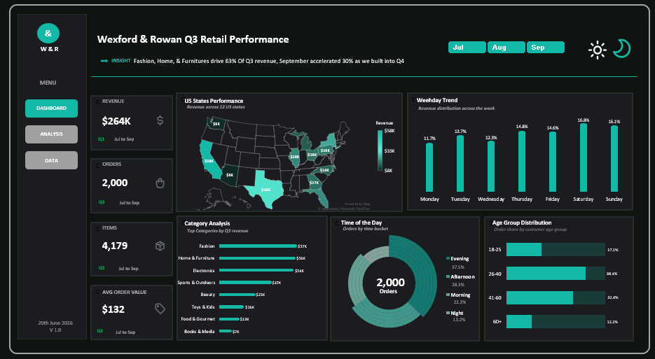

# Wexford & Rowan Q3 Retail Performance Analysis

**Microsoft Excel | Retail Analytics | PivotTables | Interactive Dashboarding | Commercial Insights**

## Overview

Wexford & Rowan is a US-based omnichannel, multi-category retailer operating across 12 states. This project analyses **Q3 2025 retail performance** to identify the demand patterns most relevant to Q4 commercial planning.

I used Microsoft Excel to clean and prepare the order data, build PivotTables, create interactive charts, and assemble an executive dashboard focused on revenue, order activity, product categories, geography, customer age groups, weekdays, and time-of-day demand.

The analysis is designed to support practical decisions around **Q4 stock allocation, staffing, store hours, and marketing investment**.

---

## Key Results at a Glance

| KPI | Result |
|---|---:|
| Q3 Revenue | **$263,641** |
| Total Orders | **2,000** |
| Items Sold | **4,179** |
| Average Order Value | **$131.82** |
| Strongest Month | **September — $105,741** |
| September Revenue Growth vs August | **29.8%** |
| Top Category | **Fashion — $56,670** |
| Top State | **California — $58,462** |
| Strongest Weekday | **Saturday — $44,227** |
| Dominant Age Group | **26–40 — 38.4% of orders** |
| Peak Time of Day | **Evening — 37.45% of orders** |

> **Executive finding:** Fashion, Home & Furniture, and Electronics generated roughly **63% of Q3 revenue**, while September revenue accelerated by almost **30% month over month**. Demand was strongest among customers aged 26–40, during evening periods, and on Saturdays.

---

# Dashboard



The executive dashboard consolidates the main Q3 commercial signals into a single interactive Excel reporting view.

### Dashboard coverage

- Q3 revenue
- Orders
- Items sold
- Average order value
- State-level revenue
- Weekday revenue distribution
- Product-category performance
- Time-of-day order behaviour
- Customer age-group distribution
- Month filtering
- Dashboard navigation
- Light/dark dashboard design

---

# Business Problem

Ahead of Q4 holiday planning, commercial leadership needed an evidence-led view of the factors driving Q3 performance.

The analysis addresses the following questions:

1. What were total Q3 revenue, orders, and items sold?
2. Which month performed strongest and how did performance shift month over month?
3. Which weekdays generated the strongest and weakest sales?
4. Which product categories drove the most revenue?
5. Which US states led performance and which were comparatively underserved?
6. Which customer age groups accounted for the largest share of orders?
7. Which time-of-day windows generated the most activity?
8. Which payment methods accounted for the greatest order volume?

---

# Analytical Workflow

The project followed an Excel-based analytics workflow:

**Raw Orders → Data Cleaning → Helper Columns → Excel Table → PivotTables → Interactive Charts → Executive Dashboard → Commercial Recommendations**

### Data preparation

The source data was prepared by:

- Removing duplicate orders
- Standardising region/state text
- Adding Month and Weekday helper fields
- Structuring the cleaned dataset as an Excel table
- Building PivotTables for the major business questions

This created a reusable analytical layer for the dashboard rather than relying on manually calculated chart values.

---

# Key Business Insights

### 1. September created strong momentum entering Q4

Revenue increased from **$81,451 in August to $105,741 in September**, an increase of approximately **29.8%**.

Orders increased from **625 to 798**, while items sold increased from **1,293 to 1,698**.

This indicates that September's improvement was supported by both higher order activity and greater item volume.

### 2. Three categories account for most Q3 revenue

Fashion generated approximately **$56.67K**, followed closely by Home & Furniture at **$55.87K** and Electronics at **$54.12K**.

Together, these three categories generated approximately **63% of Q3 revenue**.

By contrast, Books & Media generated approximately **$6.58K**, making it the weakest revenue category.

### 3. California is the strongest geographic market

California generated approximately **$58.46K**, making it the highest-revenue state.

Texas followed at approximately **$37.60K**, while New York generated approximately **$24.70K**.

The state-level spread suggests that Q4 marketing and stock allocation should reflect geographic demand rather than applying a uniform national approach.

### 4. Weekend demand is commercially important

Saturday generated approximately **$44.23K**, or **16.8% of Q3 revenue**, making it the strongest weekday.

Monday was the weakest at approximately **$30.91K**, or **11.7%**.

This supports aligning staffing, service capacity, and campaign timing with stronger weekend demand.

### 5. Customers aged 26–60 dominate order activity

Customers aged **26–40 accounted for 38.4% of orders**, while customers aged **41–60 accounted for 32.35%**.

Together, these groups generated more than **70% of total orders**, making them central to customer targeting and merchandising decisions.

### 6. Evening is the highest-demand time window

Evening orders represented approximately **37.45%** of total activity.

Afternoon accounted for **28.25%**, Morning **22.15%**, and Night **12.15%**.

This creates a clear staffing and service-planning signal for Q4 peak periods.

### 7. Card payments dominate order volume

Card was the leading payment method with **978 orders** and approximately **$126.96K in revenue**.

Digital Wallet followed with **403 orders**, while Buy Now Pay Later accounted for **314 orders**.

Although payment method is not displayed as a dedicated chart on the final dashboard, it remains part of the underlying PivotTable analysis and provides an additional view of customer purchasing behaviour.

---

# Business Recommendations

**Prioritise Q4 stock around proven category demand**  
Protect availability in Fashion, Home & Furniture, and Electronics while reviewing weaker categories before committing additional seasonal stock.

**Allocate state-level marketing selectively**  
Use stronger markets such as California and Texas as priority commercial areas while investigating whether lower-performing states represent limited demand or underdeveloped opportunity.

**Increase operational coverage during peak periods**  
Align staffing and service capacity with evening and weekend demand, particularly Saturday activity.

**Target the core 26–60 customer base**  
Use customer age patterns to guide campaign targeting while testing opportunities to grow engagement among younger and older groups.

**Plan for continued September momentum carefully**  
September's acceleration is encouraging, but Q4 plans should distinguish sustained demand from short-term seasonal uplift.

**Support dominant payment behaviours**  
Maintain a reliable card-payment experience while continuing to support Digital Wallet and Buy Now Pay Later options for customers who prefer alternative payment methods.

---

# Excel Development

### Excel capabilities demonstrated

- Data cleaning
- Duplicate removal
- Text standardisation
- Helper columns
- Excel Tables
- PivotTables
- PivotCharts
- KPI cards
- Interactive slicers
- Filled map visualisation
- Column charts
- Lollipop-style category chart
- Progress-bar visualisation
- Donut chart
- Dashboard navigation
- Light and dark dashboard design
- Commercial data storytelling

---

# Dataset

The cleaned analytical dataset contains **2,000 unique Q3 2025 orders** across 12 US states and eight product categories.

Key fields include:

- Order ID
- Product Category
- Order Date
- Time Slot
- Customer Age Group
- Items in Order
- Price per Item
- Total Order Value
- Payment Method
- Customer Region
- Month
- Weekday

For field-level definitions, see the **[Data Dictionary](documentation/data_dictionary.md)**.

---

# Tools & Skills

### Tools
- **Microsoft Excel** — data preparation, PivotTables, interactive charts, dashboard development

### Analytical skills
- Retail performance analysis
- Revenue analysis
- Product-category analysis
- Geographic analysis
- Customer demographic analysis
- Time-of-day analysis
- Payment-method analysis
- Trend analysis
- KPI reporting
- Commercial insight generation
- Dashboard design
- Data storytelling

---

# Repository Structure

```text
wexford-rowan-retail-performance-analysis/
│
├── README.md
│
├── data/
│   └── Wexford_Rowan_Q3_Clean_Data.xlsx
│
├── images/
│   └── wexford_rowan_q3_dashboard.png
│
└── documentation/
    └── data_dictionary.md
```

---

# Project Context

Wexford & Rowan is a portfolio case-study business. This project demonstrates how Microsoft Excel can be used to transform retail order data into an interactive commercial reporting solution for Q4 planning decisions.

---

## Author

**Ifeoma Edeh**

**Data Analyst | Power BI | Excel | SQL | Data Visualisation**
